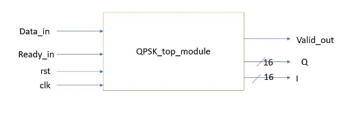
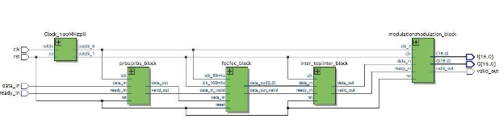
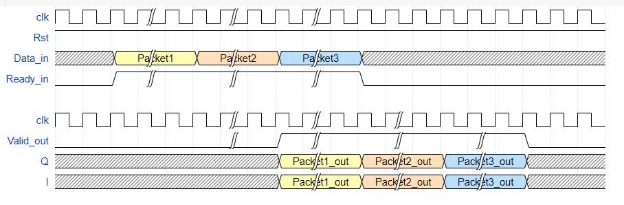
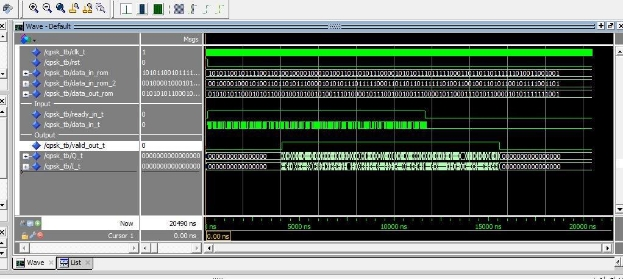

## Overview
Quartus project that includes the RTL implementation of part of the PHY layer of a WiMax system; namely “Channel Coding” (QPSK only) as described in section 8.4.9 in WiMax Standard (IEEE Std 802.16-2007). WiMax PHY including “Channel Coding” has different parameters that are set by the MAC layer. There are five different blocks within the “Chanel Coding”, each has different parameters that might require several implementations. In this project only one implementation per block is done and verified.

## Channel Coding Procedures
1.	Randomization (see 8.4.9.1).
2.	FEC encoding (see 8.4.9.2).
3.	Bit interleaving (see 8.4.9.3).
4.	Repetition (see 8.4.9.5), only applied to QPSK modulation.
5.	Modulation (see 8.4.9.4). 
6.	Orthogonal Frequency Division Multiple Access (OFDMA); Inverse Fast Fourier Transform (iFFT) 

Note: ***This project uses a PLL IP. The project was verified on a DE0-CV board using Quartus prime. Consider replacing the IP was a suitable one if you're using a different board or design software***

## Top Module (QPSK_phase3.vhd)

**Ports:**

|**Signal**  |**In /Out**  |**Width** |**Description** |
| - | :- | - | - |
|Clk\_50mhz |In  |1 |Input clock to the block of frequency 50MHz |
|Data\_in |In  |1 |Input data |
|Ready\_in |In  |1 |Signal to identify that input is ready |
|Rst |In |1 |Reset |
|Valid\_out |In |1 |Signal to identify that output is valid |
|Q |Out |16 |Output data |
|I |Out |16 |Output data |

**Block Diagram:** 

**RTL:** 

1-  The data are processed in the four blocks 

2-  The output stream is valid and continuous as long as the input stream is ready and continuous.

3-  The I and Q points of the QPSK constellation is in Q15 format (16-bit fixed point, MSB as sign bit, 15 fractional bits, and two’s complement.)

**Waveform:**  

**Results:** 

## QPSK verify wrapper (QPSK_phase3.vhd)

The pass signal turns to 1 only if all the Q and I output bits ar valid

**For more information about each block implementation, FSM, waveform and results, check the Report.pdf file**
